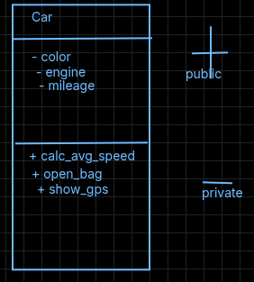
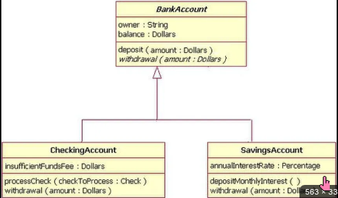

# OOPS
### object oriented programming 

1. generality to specificity

2. alag treka of programming
---


# OOPS CONCEPTS

+ object 
+ class 
+ polymorphism 
+ encapsulation 
+ inheritance 
+ abstraction

---

3. class is blueprint

4. everything in python is object

5. object belong to a class

6. 1 -> <class 'int'>

7. #variable and object same cheez

8. for python data type is class and variable storing that data is object

```

        class
        /    \   
    Data     Functions
or Property   or Behaviour
(attribute)              (method)

```

eg:-

```py

class Car:
    color="blue"#data
    model="suzuki"#data

    #method
    def calcualte_avg_speed(km,time):
        #some code

```

ThisIsPAscalCase  
thisIsCamelCase  
this_is_snake_case  

class name should be in PascalCase
method name should be in snake_case  




9. Object is instance of the class

10. to make a class we have to follow syntax  object= Class()
but list is also class why we use list=[1,2,3] syntax

11. reason is for builtin class this is object literal (easy way to make objects)

12. lis = list()  also work

13. Function vs Methods(method special function written inside class)(function are not written in class)

14. len() => function object.__len__() => method

15. object.func(arg) => method ( func is defined in class of object ) (this is accesable by object of class in which method is define )

16. func(arg) => func

17. __init__() is special method of python classes which is a constructor which automtically executes on creating an object 
__init__(self) have self argument

18. constructor it creates object (construct obj) (constructor is specail method)

19. __init__ constructor hai

20. diff btwn other lang and python oops is constructor name is same as class in other lang C++ java while not in case of python it is __init__ in python

21. specialmethod == magic method == dunder method

22. magic method start with double under score method name then ends with double under score

23. magic method automaticlly triggered hotey hai unko object call nhi krta 

24. Self ?? self is nothing but the address of object which calls the constructor method 

25. every method defination take argument self __init__ too

26. obj.method() -> by default method takes an argument obj here

27. class is made up of data and method which only can access by objects not even by methods thats why to use data / method we use self and pass it as arg in each method and to call method we use self.method inside method 

> concept 1 class is made up of data and method which only can access by objects


28. __str__ is return when your object is passed to print function (you should return inside __str__)

29. __add__ __sub__ __mul__ __truediv__ all these magic methods take argument self and other and it trigger when + - * / operation btwn two object of these method class happen there is an example in fraction.py

30. encapsulation :- instance variable are variable for which value of variable is diffrent for diffrent object eg self.pin pin is diffrent for obj1 and obj2 obj3 ....

31. instances ko class ke bhaar se yani __main__ se obj.instance laga kr change kr skte hai to stop that ( c++ java has access modifier public pvt u know ) but in python what we do is use var name __var instead of var it will hide my instance not completly but yes it will and for method same cheez works like method => __method

32. it really do not hide it instead python interpreter do what when he find self.__var inside class he we make it self._classname__var

33. we can use obj._classname__var to change it from __main__ but on changing obj.__var it will not change 

34. getter setter are two method getter is one which tell the value of data and setter is one which will set value of data

35. encapsulation:- hum data ko directly khula nhi chod skte usko phele hide kro __main__ se fir usko access krna hoto getter setter method banao 

36. attribute followed by 2 underscore

37. refrence variable
# refrence variable


```py
class Test:
    def __init__(self):
        pass

Test() #isko store nhi kiya ye kho gaya

obj1 = Test() # isko obj1 mai store kr liya 
#now obj1 mai onject store hai isliye isko referance var bolenge 
#obj1 is refering to object hence it is reference variable

 
```
38. # pass by reference

``` py
class person:
    def __init__(self,name,cool):
        self.name=name
        self.cool=cool

# call by reference pass by refernce
def join_fightclub(fighter):
    print(id(fighter))
    fighter.name="tyler durden"
    fighter.cool=True

person1 = person("Narrator",False)
print("before fight club")
print(id(person1))
print("\n",person1.name,person1.cool,"\n")
join_fightclub(person1)
print("after joining fight club")
print("\n",person1.name,person1.cool) 

```

every object in python passed in a function is passed by referance any change in it in function is also for __main__ scope (global scope) and it is mutable 

39. class variable / static variable woh variable harr object ke liye same hota h unlike instance variable

 

``` py

class Test:
    #static variable
    counter=0

    def __init__(self,name):
        # instance variable
        self.name=name
        Test.counter+=1

```

40. corect way , syntax to access class variable is class_name.variable_name
    object.static_varname also work but not right way

41. if i have to make an method that will only dealt with static variables then i will donot pass
    self in it (it is known as static method)  

42. agregate

43. inheritance (top(parent class) > down(child class)) (do not inherit pvt thing just inherit data members methods constructor )

44. philosphy of inheritance dry do ruse your code

45.  how to inherit

``` py

class Parent:
    def __init__():
        pass

class Child(Parent):
    pass

```

