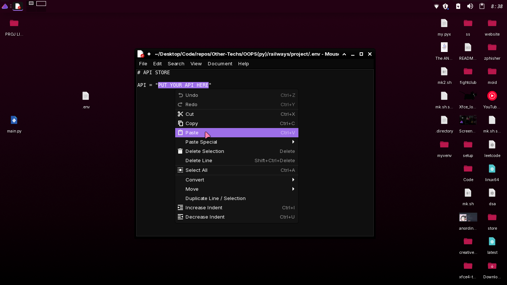

# Basic indian railway application

concept used

+ Python

+ OOPS

+ Requests(api call)

+ Bash

# how to get api and place api

[go to this link create account and copy the api key and paste it in .env file](https://railradar.in/)

.env is a hidden file first toggle on show hidden files (ctrl+H) then open it in text editor and paste api string in front of API variable link this

```
API = "sdhauhuawhfhasfhawisihesi"
```




# how to use it for unix based os (linux/mac)

``` bash
chmod +x unix.sh

```

``` bash
./unix.sh

```

# for windows 

``` bat
.\window.bat

```


