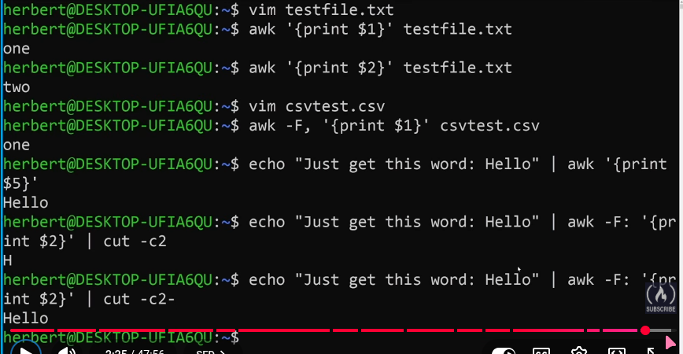
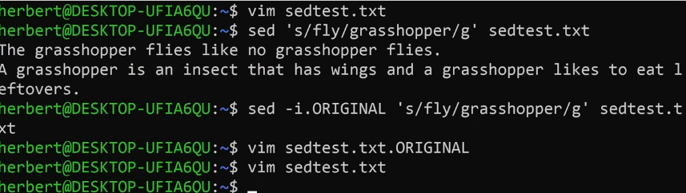

# BASH (Bourne Again Shell)

shell language

check(ansible) too

used in linux , wsl , mac

pro:- most used shell  
cons:-  No OOPS , difficult syntax , better python and tool ansible


# echo

print the positional argument

``` bash
$ echo Hello
Hello
$ |
```

# cat 

print the content in file which passed in positional argument

``` bash
$ cat mk.txt
Hello
$ |
```

# ls

``` bash
$ ls
Desktop Downloads Pictures 
```

list content of directory

# pwd present working directory

(~) -> home directory

# shell

``` bash
$ echo $SHELL
\bin\bash
$ |
```


# shebang

```
	Computing: In Unix-like operating systems, a shebang (or hashbang) is the character sequence #! at the beginning of a script.  This directive tells the operating system which interpreter program (such as Python or Bash) should be used to execute the file
```

bash interpreter location \bin\bash

``` bash
#!/bin/bash
echo Hello
```

``` bash
$ bash mk.sh
Hello
$ ./mk.sh
permission denied
$ chmod u+x mk.sh
$ ./mk.sh
Hello
$ |
``` 

# variables

``` bash
#!/bin/bash

var1=hello
var2=world
echo $var1 $var2
```

# input

``` bash
#!/bin/bash

echo "your name : "
read var1

echo "your surname : "
read var2

echo $var1 $var2
```

# positional argument

Positional parameters in Bash are special variables that store the arguments passed to a script or function, determined by their order rather than a name

``` bash
#!/bin/bash
echo $v1 $2
```

``` bash
$ ./mk.sh mubashshir khan
mubashshir khan
$ |
```

# piping
``` bash
$ ls -l ~/Desktop | grep Code
Code
$ |
```

# Output redirection

overwrite

``` bash
$ bash mk.sh > mk.txt
$ cat mk.txt
Hello
$ |
```
 
append as new line

``` bash
$ bash mk.sh >> mk.txt
$ cat mk.txt
Hello
Hello
$ |
```

# wc
 
wc is word count basic cli utility
mk.txt :- yes i am a programmer 
``` bash
$ wc -w mk.txt
5 mk.txt
$ wc -w << mk.txt
5
$ wc -w <<< " HELLO WORLD "
2
$ |
```

``` bash 
$ cat << EOF
> I will
> type some
> text here
> EOF
I will
type some
text here
$ |
```

# test operator

1 -> true program run with no error code with 0
2 -> false program run with error code with 1
``` bash
$ [ hello = hello ]
$ echo $?
0
$ [ 1 = 0 ]
$ echo $?
1
$ [ 1 -eq 1 ]
$ echo $?
1
$ |
```


# conditional statements

``` bash
#!/bin/bash

if [ ${1,,} = muabashshir ]; then
	echo "you are the boss"
elif [ ${1,,} = help ]; then
	echo "you are not my boss"
else
	echo "Go away"
fi
```

# 

case statement (switch case)

``` bash
#!/bin/bash

case ${1,,} in
	mubashshir | mubashshir)
		echo " you are my boss";;
	help)
		echo  "you are not my boss";;
	*)
		echo "go away"
esac
```

# array 

``` bash
$ my_first_list = (one two three four five)
$ echo $my_first_list
one
$ echo ${my_first_list[0]}
one
$ echo ${my_first_list[@]}

one two three four five
```

# LOOP
``` bash
$ my_first_list = (one two three four five)
$ for item in ${my_first_list[@]}; do echo -n $item | wc -c; done
3
3
5
4
4
$ |
```

# functions

``` bash
#!/bin/bash

function(){
	up=$(uptime -p | cut -c4-)
	since=$(uptime -s)
	cat << EOF
-----
this machine has been up for ${up}
it has been runing since ${since}
-----
EOF
}
function
```

``` bash
up="before"
since="function"
echo $up
echo $since
function(){
	local up=$(uptime -p | cut -c4-)
	local since=$(uptime -s)
	cat << EOF
-----		
this machine has been up for ${up}
it has been runing since ${since}
-----
EOF
echo $up
echo $since
}
function
```


# arguments
``` bash
#!/bin/bash

function(){
	echo "hello" $1
}
function mubashshir
```

#returning func

``` bash
#!/bin/bash

function(){
	echo "hello" $1
	if [ {1,,} = "mubashshir" ]; then
		return 0
	else
		return 1
	fi
}
function $1
if [ $? = 1 ]; then
	echo "who are you"
```
```
$ ./returningfunc.sh helly
who are you
```

# AWK



# sed


